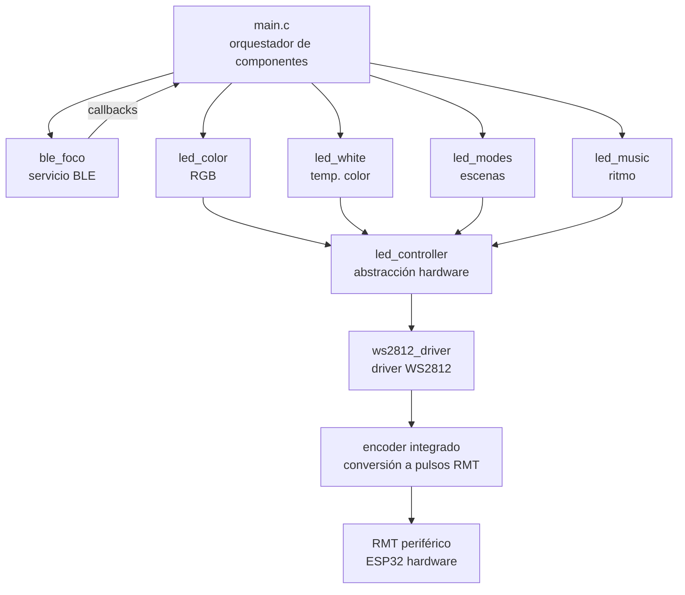

# Foco Inteligente WS2812 + ESP32

**Autor**: Rodrigo Calle Condori  
**Fecha**: Abril 2026  
**Versión**: 1.5.0  

Control de tira LED WS2812 vía BLE con ESP32. Proyecto desarrollado con **arquitectura profesional por capas** como base para un producto comercial de iluminación inteligente.

## ✨ Características

### ✅ Implementado
- Control de color RGB (16 millones de colores)
- Control de temperatura de color blanco (2700K - 6500K)
- Ajuste de brillo global (0-100%)
- **Modos y escenas preprogramadas:**
  - 🌈 Arcoíris (transición de colores cíclica)
  - 🌅 Atardecer (transición de temperatura blanca)
  - 🎉 Fiesta (colores aleatorios rápidos)
  - 😌 Relajación (transiciones suaves de colores pastel)
  - 🌙 Nocturno (luz cálida tenue)
  - ⛈️ Tormenta (efecto de relámpagos aleatorios)
- Comunicación BLE con app móvil (nRF Connect / Flutter)
- **Arquitectura profesional por capas** (driver → abstracción → dominio → aplicación)
- **Migrado a ESP-IDF v6.0** (compatible con las últimas APIs)

### ⏳ En desarrollo
- Sincronización musical
- Conexión WiFi y asistentes de voz

## 🏗️ Arquitectura del Proyecto


## 🔧 Migración a ESP-IDF v6.0
El proyecto ha sido migrado exitosamente a ESP-IDF v6.0. Los cambios realizados incluyen:

- Actualización de dependencias en CMakeLists.txt para compatibilidad con v6.0

- Mantenimiento del driver RMT moderno (driver/rmt_tx.h), compatible con ambas versiones

- Eliminación de APIs deprecadas

- Verificación de compatibilidad con la nueva toolchain
### Requisitos:
ESP-IDF v6.0 o superior

- Python 3.8+

- Git

## 📦 Componentes Implementados

| Capa | Componente | Descripción | Estado |
|:---|:---|:---|:---|
| **Driver** | `ws2812_driver` | Driver unificado para WS2812. Configura RMT, maneja buffer DMA y convierte bytes a pulsos mediante encoder integrado. | ✅ Estable |
| **Abstracción HW** | `led_controller` | Control de brillo global y buffer de colores RGB. Aplica brillo y gestiona estado. | ✅ Estable |
| **Dominio** | `led_color` | Control de color RGB de alto nivel. API intuitiva para colores sólidos. | ✅ Estable |
| **Dominio** | `led_white` | Control de temperatura de color blanco (2700K-6500K). Convierte Kelvin a RGB usando algoritmo de Tanner Helland. | ✅ Estable |
| **Dominio** | `led_modes` | Efectos y escenas preprogramadas con velocidad ajustable. | ✅ Estable |
| **Aplicación** | `ble_foco` | Servicio BLE personalizado con UUIDs para color, brillo, modo y temperatura blanca. | ✅ Estable |
| **Futuro** | `led_music` | Sincronización con ritmo musical. | ⏳ Futuro |

## 🎮 Modos de Operación

| Modo | ID | Descripción | Comportamiento |
|:---|:---|:---|:---|
| **Sólido** | 0 | Color fijo | Muestra el último color seleccionado (por color o blanco) |
| **Arcoíris** | 1 | 🌈 | Transición cíclica de colores (velocidad configurable) |
| **Atardecer** | 2 | 🌅 | Transición suave entre 2700K y 6500K |
| **Fiesta** | 3 | 🎉 | Colores aleatorios rápidos (velocidad configurable) |
| **Relajación** | 4 | 😌 | Transiciones lentas de colores pastel |
| **Nocturno** | 5 | 🌙 | Luz cálida tenue (brillo y temperatura configurables) |
| **Tormenta** | 6 | ⛈️ | Relámpagos blancos aleatorios (intensidad configurable) |

## 🔧 Hardware Requerido
- ESP32 (cualquier variante)
- Tira de LEDs WS2812 (24 LEDs recomendado)
- Fuente de alimentación 5V/2A-3A (para 24 LEDs a máximo brillo)
- MOSFET convertidor de nivel (3.3V → 5V para datos)
- Resistencia 330Ω-470Ω en línea de datos

## 📱 Uso con nRF Connect

### 1. Conectar ESP32 a alimentación
### 2. Escanear dispositivos BLE
### 3. Conectar a **"ESP_FOCO_TEST"**
### 4. Escribir en características:

| Característica | UUID | Formato | Rango | Ejemplo |
|:---|:---|:---|:---|:---|
| **Color** | `0xFF01` | 3 bytes [R, G, B] | 0-255 cada uno | `FF0000` = Rojo |
| **Brillo** | `0xFF02` | 1 byte | 0-100 | `64` = 100% |
| **Modo** | `0xFF03` | 2 bytes [modo, velocidad] | modo: 0-6, velocidad: 0-100 | `01 32` = Arcoíris 50% |
| **Blanco** | `0xFF04` | 2 bytes (little-endian) | 2700-6500K | `8C 0A` = 2700K |

### 📝 Tabla de modos para nRF Connect:

| Modo | Valor (1er byte) | Velocidad (2do byte) | Ejemplo |
|:---|:---|:---|:---|
| Sólido | `00` | `00` | `00 00` |
| Arcoíris | `01` | `32` (50) | `01 32` |
| Atardecer | `02` | `32` | `02 32` |
| Fiesta | `03` | `32` | `03 32` |
| Relajación | `04` | `32` | `04 32` |
| Nocturno | `05` | `32` | `05 32` |
| Tormenta | `06` | `32` | `06 32` |

### 📝 Notas sobre temperatura de color (modo blanco):
- **2700K**: Muy cálido (ámbar) - `8C 0A` en hexadecimal
- **4000K**: Neutro - `A0 0F` en hexadecimal
- **6500K**: Muy frío (azul) - `64 19` en hexadecimal

Los valores se envían en formato **little-endian** (byte bajo primero):
- 2700K = 0x0A8C → enviar `8C 0A`
- 4000K = 0x0FA0 → enviar `A0 0F`
- 6500K = 0x1964 → enviar `64 19`

## 🚀 Compilación y Flash

```bash
# Configurar target
idf.py set-target esp32

# (Opcional) Configurar opciones
idf.py menuconfig

# Compilar
idf.py build

# Grabar y monitorear
idf.py flash monitor

# Para salir del monitor: Ctrl + ]
```
## 📂 Estructura del Proyecto

```
foco_inteligente/
├── components/
│   ├── ws2812_driver/               # DRIVER unificado WS2812
│   │   ├── include/
│   │   │   └── ws2812_driver.h
│   │   ├── ws2812_driver.c          # Configura RMT + encoder integrado
│   │   └── CMakeLists.txt
│   ├── led_controller/              # CAPA DE ABSTRACCIÓN
│   │   ├── include/
│   │   │   └── led_controller.h
│   │   ├── led_controller.c         # Brillo, buffer RGB
│   │   └── CMakeLists.txt
│   ├── led_color/                   # CAPA DE DOMINIO
│   │   ├── include/
│   │   │   └── led_color.h
│   │   ├── led_color.c
│   │   └── CMakeLists.txt
│   ├── led_white/                   # CAPA DE DOMINIO
│   │   ├── include/
│   │   │   └── led_white.h
│   │   ├── led_white.c
│   │   └── CMakeLists.txt
│   ├── led_modes/                   # CAPA DE DOMINIO
│   │   ├── include/
│   │   │   └── led_modes.h
│   │   ├── led_modes.c
│   │   └── CMakeLists.txt
│   └── ble_foco/                    # COMUNICACIÓN BLE
│       ├── include/
│       │   └── ble_foco.h
│       ├── ble_foco.c
│       └── CMakeLists.txt
├── main/
│   ├── CMakeLists.txt
│   └── main.c                       # Orquestador principal
├── CMakeLists.txt                   # Proyecto raíz
└── README.md
```
## 🔄 Flujo de Inicialización
```
// 1. Driver de hardware
ws2812_driver_init(&driver_config);

// 2. Capa de abstracción
led_controller_init(&led_config);

// 3. Capa de dominio
led_color_init();
led_white_init();
led_modes_init();

// 4. Comunicación BLE
ble_foco_register_callbacks(&cbs);
ble_foco_init();
```

## 📬 Contacto
rodrigocallecondori@gmail.com

# 📝 Licencia
Copyright (c) 2026 Rodrigo Calle Condori. Todos los derechos reservados.

Este proyecto es de propiedad privada y no puede ser distribuido, modificado ni utilizado sin autorización explícita del autor. Todos los derechos de propiedad intelectual pertenecen al autor.