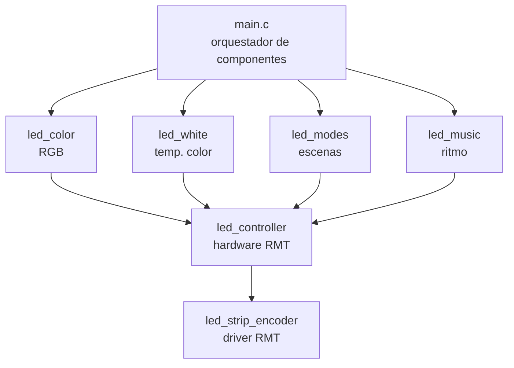

# Foco Inteligente WS2812 + ESP32

**Autor**: Rodrigo Calle Condori  
**Fecha**: Marzo 2026  
**Versión**: 1.1.0  

Control de tira LED WS2812 vía BLE con ESP32. Proyecto desarrollado con arquitectura profesional y modular como base para un producto comercial de iluminación inteligente.

## ✨ Características
- ✅ Control de color RGB (16 millones de colores)
- ✅ Ajuste de brillo global (0-100%)
- ⏳ Modos de operación (en desarrollo)
- ⏳ Temperatura de color blanco (futuro)
- ⏳ Sincronización musical (futuro)
- ✅ Comunicación BLE con app móvil (nRF Connect / Flutter)
- ✅ Arquitectura modular y escalable

## 🏗️ Arquitectura del Proyecto
En este proyecto solo esta implemetado el módulo led_color


## 📦 Componentes Implementados

| Componente | Descripción | Estado |
|:---|:---|:---|
| **`led_controller`** | Capa base de hardware. Controla LEDs WS2812 vía RMT, gestiona brillo global y buffer de píxeles. | ✅ Estable |
| **`led_color`** | Módulo de alto nivel para control RGB. Proporciona API intuitiva para colores sólidos y efectos básicos. | ✅ Estable |
| **`led_strip_encoder`** | Driver de bajo nivel para WS2812. Convierte bytes a señales RMT precisas. | ✅ Estable (del ejemplo) |
| **`ble_foco`** | Servicio BLE personalizado con UUIDs 0x00FF (servicio), 0xFF01 (color), 0xFF02 (brillo), 0xFF03 (modo). | ✅ Estable |
| **`led_white`** | Control de temperatura de color (blanco frío↔cálido). | ⏳ Futuro |
| **`led_modes`** | Efectos y escenas preprogramadas (arcoíris, atardecer, fiesta, etc.). | ⏳ Futuro |
| **`led_music`** | Sincronización con ritmo musical. | ⏳ Futuro |

## 🔧 Hardware Requerido
- ESP32 (cualquier variante)
- Tira de LEDs WS2812 (24 LEDs recomendado)
- Fuente de alimentación 5V/2A-3A (para 24 LEDs a máximo brillo)
- MOSFET convertidor de nivel (3.3V → 5V para datos)
- Resistencia 330Ω-470Ω en línea de datos

## 📱 Uso con nRF Connect

### 1. Conectar ESP32 a alimentación
### 2. Escanear dispositivos BLE
### 3. Conectar a **"ESP_FOCO_TEST"**
### 4. Escribir en características:

| Característica | UUID | Formato | Ejemplo |
|:---|:---|:---|:---|
| **Color** | `0xFF01` | 3 bytes [R, G, B] | `FF0000` = Rojo |
| **Brillo** | `0xFF02` | 1 byte (0-100) | `64` = 100% |
| **Modo** | `0xFF03` | 1 byte (reservado) | `00` = Sólido |

## 🚀 Compilación y Flash

```bash
# Configurar target
idf.py set-target esp32

# (Opcional) Configurar opciones
idf.py menuconfig

# Compilar
idf.py build

# Grabar y monitorear
idf.py flash monitor

# Para salir del monitor: Ctrl + ]
```
## 📂 Estructura del Proyecto

```
foco_inteligente/
├── components/
│   ├── led_controller/          # Capa base de hardware
│   │   ├── include/
│   │   │   └── led_controller.h
│   │   ├── led_controller.c
│   │   └── CMakeLists.txt
│   ├── led_color/               # Control RGB de alto nivel
│   │   ├── include/
│   │   │   └── led_color.h
│   │   ├── led_color.c
│   │   └── CMakeLists.txt
│   ├── ble_foco/                 # Servicio BLE personalizado
│   │   ├── include/
│   │   │   └── ble_foco.h
│   │   ├── ble_foco.c
│   │   └── CMakeLists.txt
│   └── led_strip_encoder/        # Driver WS2812 (del ejemplo)
│       ├── led_strip_encoder.c
│       └── led_strip_encoder.h
├── main/
│   ├── CMakeLists.txt
│   └── main.c                    # Orquestador principal
├── CMakeLists.txt                 # Proyecto raíz
└── README.md
```


## 📬 Contacto
Rodrigo Calle Condori
rodrigocallecondori@gmail.com

# 📝 Licencia
Copyright (c) 2026 Rodrigo Calle Condori. Todos los derechos reservados.

Este proyecto es de propiedad privada y no puede ser distribuido, modificado ni utilizado sin autorización explícita del autor. Todos los derechos de propiedad intelectual pertenecen al autor.